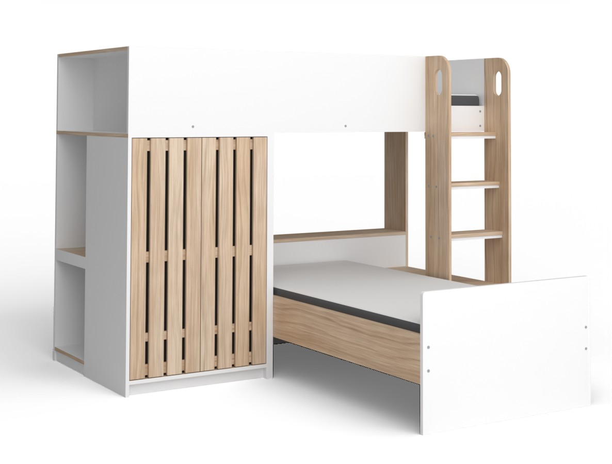
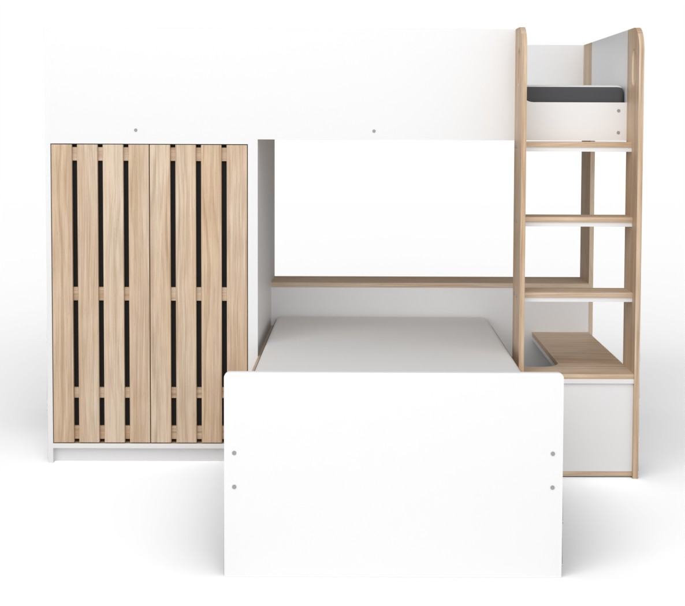
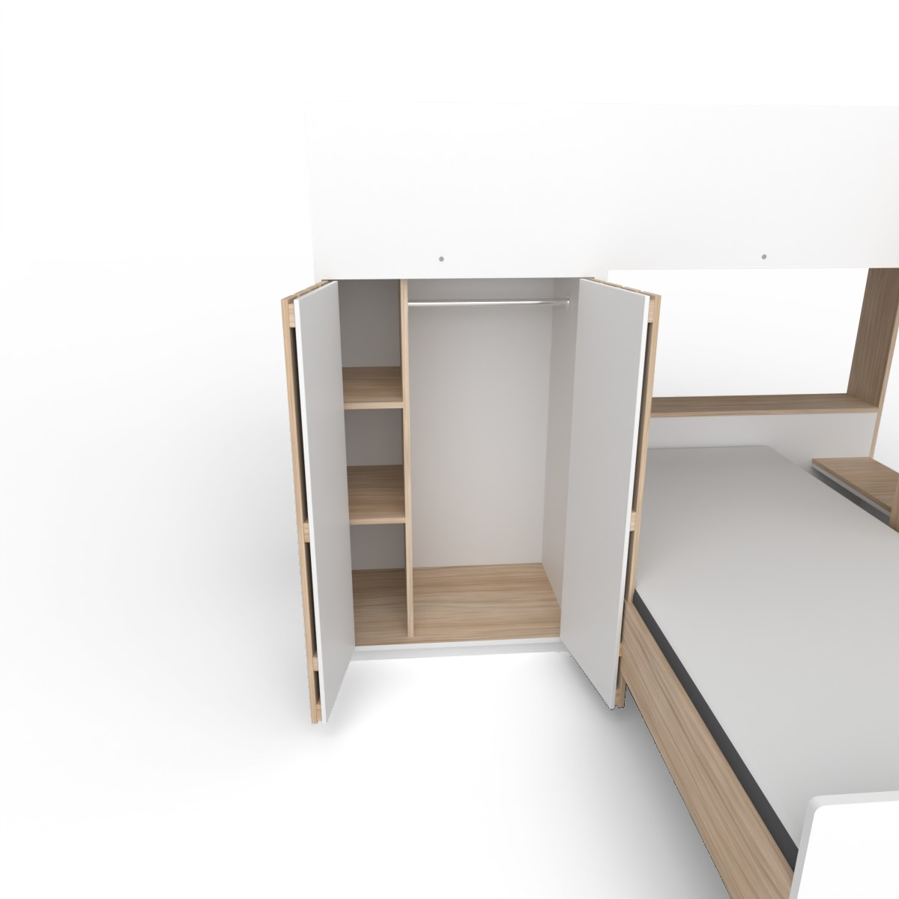
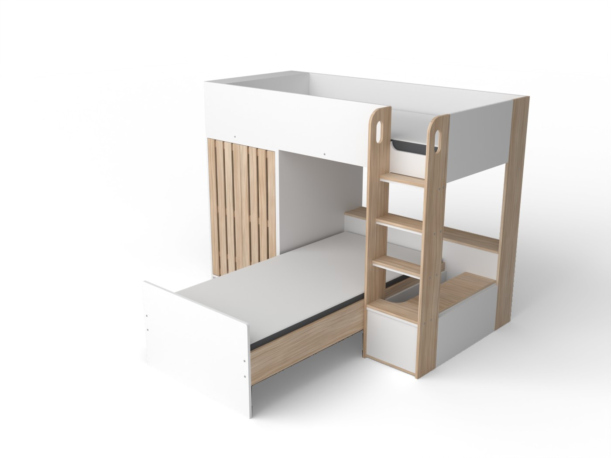
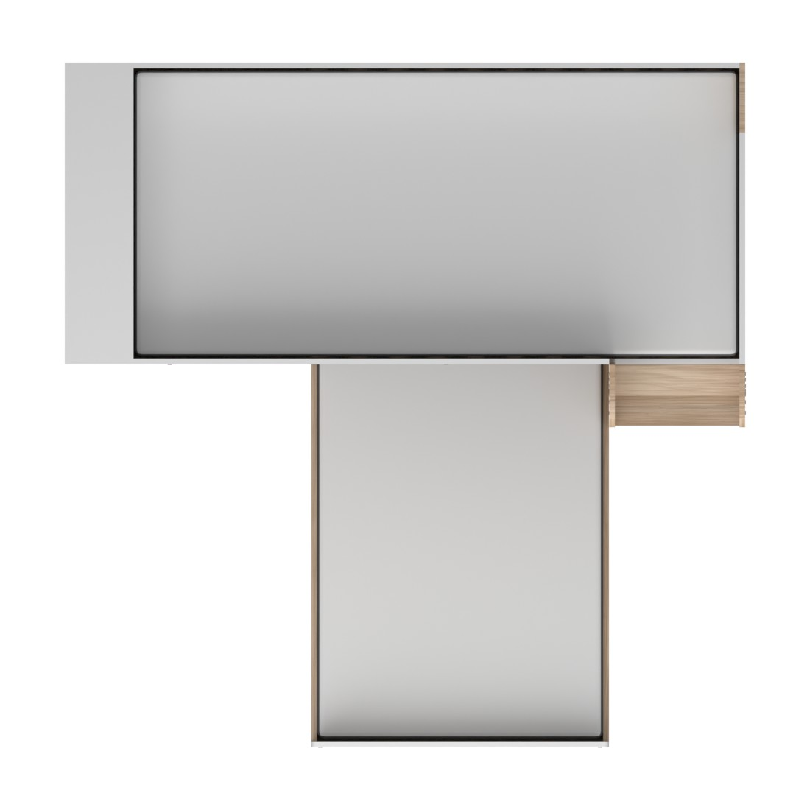

# L-shaped bunk bed with wardrobe — Blender → Unreal Engine 5

A procedural 3D model of a white and oak-effect L-shaped high sleeper
(modelled on the Habitat "Norah" L Shaped Single Bunk Bed), built with a Blender
Python script and imported into Unreal Engine 5 with an editor Python script.



| | |
|---|---|
|  |  |
|  |  |

## What's modelled

- **Top bunk**: 36 cm safety rails, an open end cubby, slats on ledges, and a low
  mattress retainer across the ladder opening.
- **Wardrobe**: two doors, each with four oak slats on battens over a dark backer.
  Inside are an oak divider, two shelves and a chrome hanging rail. The doors are
  separate meshes pivoted on their hinges.
- **Two deep cubby holes** behind the wardrobe, open to the end of the bed.
- **Staircase ladder**: wide oak stringers with rounded tops and stadium hand holds.
  Three oak-on-white treads step forward as they go down, onto a notched landing
  that sits on a box.
- **Lower bed** at 90° under the top bunk: oak side rails, slats, a 57.5 cm
  footboard and a shelf headboard. A full-height oak post carries the back-right corner.
- **Mattresses**: two 190 × 90 × 16 cm mattresses with white tops and charcoal
  borders, as separate meshes so they can be hidden.

Dimensions (cm): **214.2 L × 215.5 W × 160.4 H**. Overall size, the 36 cm rail,
the 110.3 cm wardrobe height and the mattress size come from the product
listing. Everything else was measured off the product photos (see
[Accuracy](#accuracy)).

## Folder layout

```
blender/
  build_l_bunk_bed.py   builds the model, materials, UVs, collision; exports everything
  oak_textures.py       seamless procedural oak textures (numpy)
  render_views.py       Cycles studio renders (used with --render)
  verify_exports.py     re-imports the exports and checks size, pivots, UCX, slots
unreal/
  import_l_bunk_bed.py  UE5 editor script: textures, materials, meshes, Blueprint
export/                 ready-to-use output (generated by the build script)
  SM_LBunkBed_Frame.fbx, SM_LBunkBed_Door_L.fbx, SM_LBunkBed_Door_R.fbx,
  SM_LBunkBed_Mattress_Upper.fbx, SM_LBunkBed_Mattress_Lower.fbx
  LBunkBed.fbx          all parts in one file, for other DCC tools
  LBunkBed.glb          glTF binary with embedded textures (web, three.js, etc.)
  textures/             T_Oak_BaseColor.jpg, T_Oak_Roughness.png, T_Oak_Normal.png
  manifest.json         parts, material slots, pivots, hinge data (read by the UE script)
blend/LBunkBed.blend    the Blender scene (textures referenced from export/textures)
renders/                Cycles previews
```

## Use it in Unreal Engine 5

The files in `export/` are ready to use, so you don't need Blender for this.

1. Copy this folder anywhere the editor can read. The UE project doesn't need it
   inside `Content/`.
2. Make sure **Python Editor Script Plugin** is enabled (Edit → Plugins; it's on
   by default in UE5).
3. Run `unreal/import_l_bunk_bed.py`: **Tools → Execute Python Script…**, or in
   the Output Log switch the input to *Python* and enter
   `py "C:/path/to/l-shaped-bunk-bed/unreal/import_l_bunk_bed.py"`.

The script creates, under `/Game/Furniture/LShapedBunkBed`:

| Asset | Notes |
|---|---|
| `Textures/T_Oak_*` | Normal map set to *NormalMap* compression with the green channel flipped (OpenGL → DirectX). Roughness is linear *Masks*. |
| `Materials/M_BB_Wood`, `M_BB_Solid` | Master materials. Wood exposes `Tint`, `UVTiling` and `RoughnessScale`. Solid exposes `BaseColor`, `Roughness`, `Metallic` and `Specular`. |
| `Materials/MI_BB_*` | One instance per Blender material slot: white laminate, oak, door backer, mattress top/side, screw caps, chrome. |
| `Meshes/SM_LBunkBed_*` | Static meshes with the `UCX_` box collision from Blender and generated lightmap UVs. |
| `BP_LShapedBunkBed` | `Frame`, `Hinge_Door_L/R` → `Door_L/R`, `Mattress_Upper`, `Mattress_Lower`. |

It also places one `BP_LShapedBunkBed` at the world origin. The origin is the
bed's pivot: floor level, at the middle of the back (wall) edge. The bed extends
along +Y into the room.

- **Open the doors**: select the actor, pick `Hinge_Door_L` or `Hinge_Door_R` in
  the Details panel and set its yaw. Left door: 0 to +100°. Right door: 0 to −100°.
  For gameplay, drive the same components from a Timeline.
- **Hide the mattresses**: untick *Visible* on the mattress components.
- **Options**: set these environment variables before starting the editor, or
  edit the constants at the top of the script.
  - `LBUNK_EXPORT_DIR`: folder with the FBX files and `manifest.json`
  - `LBUNK_DEST`: content folder
  - `LBUNK_SPAWN=0`: skip placing the bed in the level

  Re-running the script updates the assets and rebuilds the Blueprint.
- **UE 5.5+**: FBX import goes through Interchange, which ignores the classic
  FBX options. The script switches `Interchange.FeatureFlags.Import.FBX` off
  while importing and restores it afterwards.

To import manually instead, use the defaults for a static mesh with
*Import Materials* off and *Auto Generate Collision* off, so the UCX boxes are
used. Then assign the `MI_BB_*` instances by slot name. The door meshes are
pivoted on their hinges.

## Rebuild or change the model in Blender

The model is generated from the constants at the top of
`blender/build_l_bunk_bed.py` (in centimetres: overall size, deck height, door
opening, tread heights, notch size, and so on). Change a value and rebuild.

```bash
# With Blender installed (4.2 LTS or newer)
blender -b -P blender/build_l_bunk_bed.py -- --render

# Or with the Blender Python module (Python 3.11)
pip install bpy==4.5.14
python blender/build_l_bunk_bed.py --render --samples 128 --jpeg 90
python blender/verify_exports.py
```

Useful flags:

- `--out DIR`: export folder
- `--blend FILE`: where to save the scene
- `--render --views front,three_quarter`: render a subset of views
- `--samples N`: Cycles samples
- `--tex-size 2048`: oak texture resolution
- `--no-export`: skip writing the export files

Without `--render` a build takes about 10 seconds. Each Cycles view takes 2–3
minutes on 4 CPU cores.

Open `blend/LBunkBed.blend` to edit by hand. Each part keeps a live Bevel
modifier with harden normals (1.5 mm on boards, 2.4 cm on mattresses). The
collision boxes are in the hidden *Collision (UCX)* collection, and the studio
lights and render cameras are saved in the scene too.

### Modelling notes

- Every board is a closed solid. UVs are box-projected in world space at
  1 UV = 1 m, with U along each board's grain, so the oak runs lengthwise on
  rails, vertically on stringers and door slats, and across the treads. Each
  board gets a random UV offset so neighbours don't repeat.
- The oak maps are generated by `oak_textures.py`: tileable FFT noise for the
  fibres, warped latewood lines, and pores. The colour is calibrated to the
  photos (sRGB ≈ 204, 177, 150). The normal map uses the OpenGL convention.
- Triangle counts: frame 15.6k, each door 972, each mattress 300. That's about
  18.1k in total with bevels.
- Units: FBX files use Blender's default Unreal-compatible settings (cm, −Z
  forward, Y up, *All Local* scaling). Unreal maps Blender (x, y, z) to
  (x, −y, z) × 100. The UE script checks the imported frame bounds and adjusts
  the hinge placement if an importer doesn't mirror Y.

## Accuracy

- Overall size matches the listing: `verify_exports.py` re-imports the FBX and
  checks 214.2 × 215.5 × 160.4 cm. The extra 1.8 mm is the protruding screw caps.
- Proportions were measured from the five photos. For the front, with-mattress
  front, three-quarter and ladder close-up photos, the camera was solved from
  12–22 point correspondences (0.5–1% reprojection error). Renders from those
  cameras (`front`, `front_no_mattress`, `three_quarter` and `ladder` in
  `render_views.py`) were overlaid on the photos to adjust the geometry.
- Exposure was calibrated so white laminate and oak render at the same pixel
  values as in the photos.
- Some parts don't appear in any photo: the back, the right-hand end below the
  bunk, the inside of the landing box, and the depth of the deep cubbies. These
  follow the visible construction and are plausible guesses rather than
  measurements.

## Testing status

- The Blender pipeline was run end to end with Blender 4.5.14 LTS (the PyPI
  `bpy` module), and the build was repeated with Blender 5.0.1 with identical
  results. `verify_exports.py` passes on both: size, pivots, UCX naming and
  material slots in every FBX, plus the GLB structure.
- The Unreal script was checked for its Python logic against a stubbed `unreal`
  module. It has **not** been run inside a live Unreal Editor in this
  environment. It uses the standard UE 5.1+ editor scripting API
  (`AssetImportTask`, `MaterialEditingLibrary`, `SubobjectDataSubsystem`,
  `EditorActorSubsystem`). If a call differs in your engine version, the Output
  Log shows the line, and the FBX files can always be imported by hand as
  described above.
