# Nissan Qashqai 2017 (J11) — Blender → Unreal Engine 5

A procedural 3D model of a 2017 Nissan Qashqai (second generation, J11,
pre-facelift) in Acenta trim. It's painted Gun Metallic grey and registered
**DE17 YAU**. The interior, the alloy wheels and the tailgate badge follow the
owner's photos of the car. A Blender Python script builds it and an editor
Python script imports it into Unreal Engine 5.

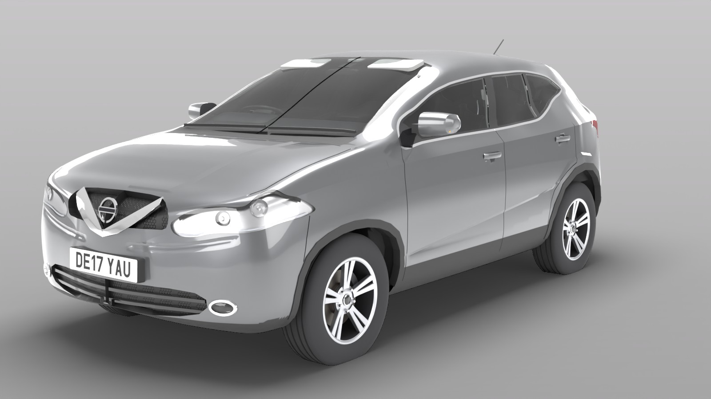

| | |
|---|---|
| 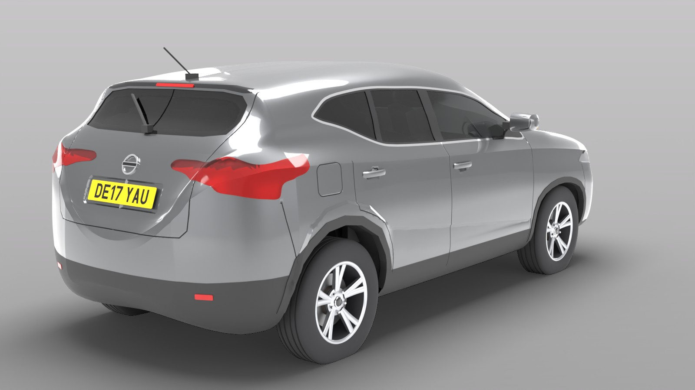 | 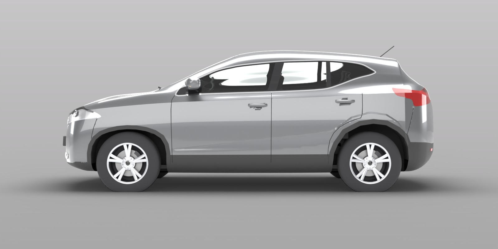 |
| 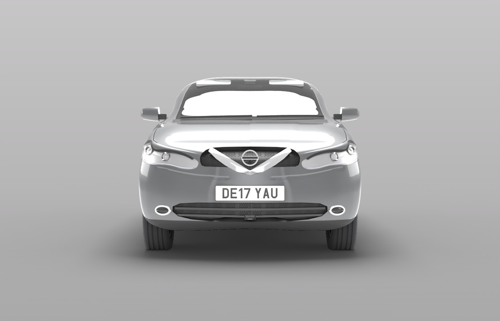 | 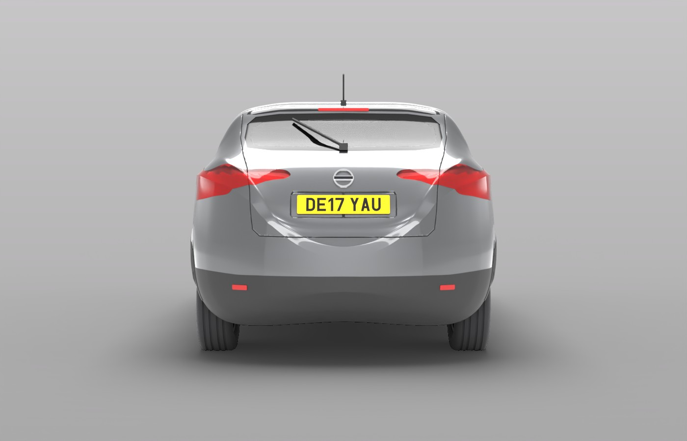 |
| 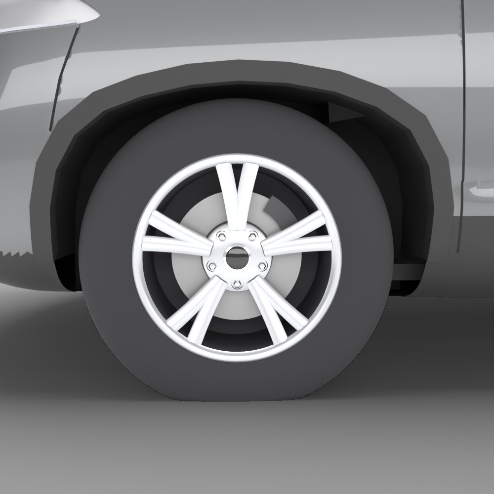 | 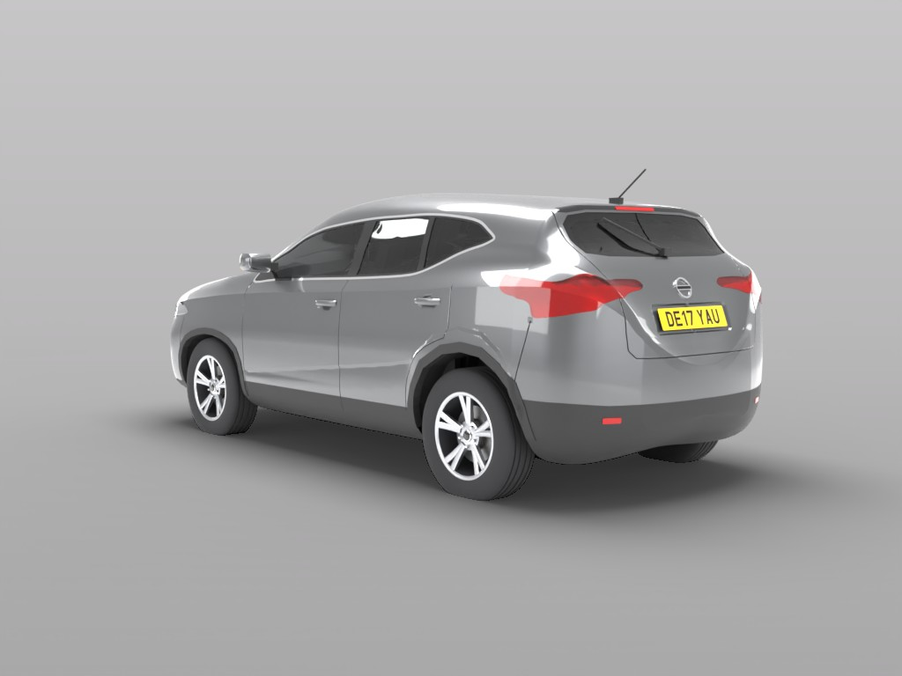 |
| 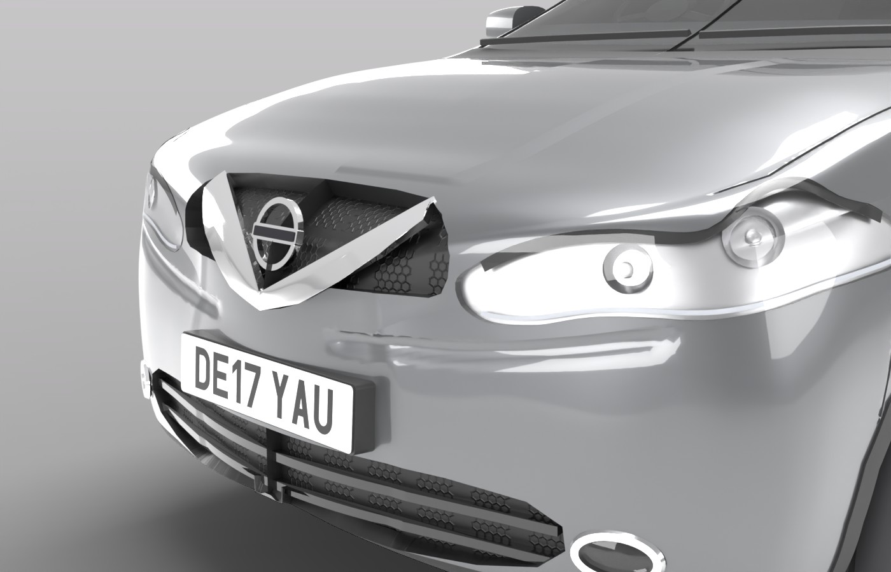 | 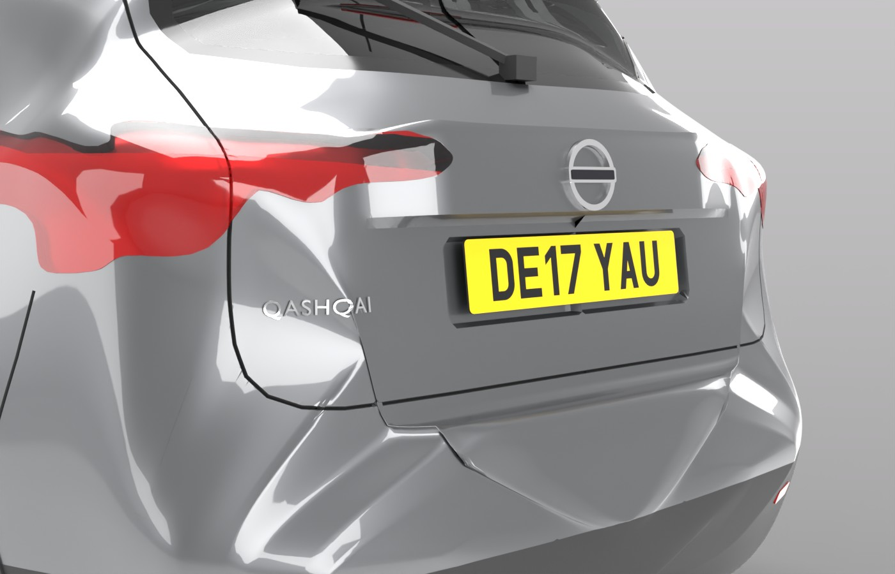 |
| 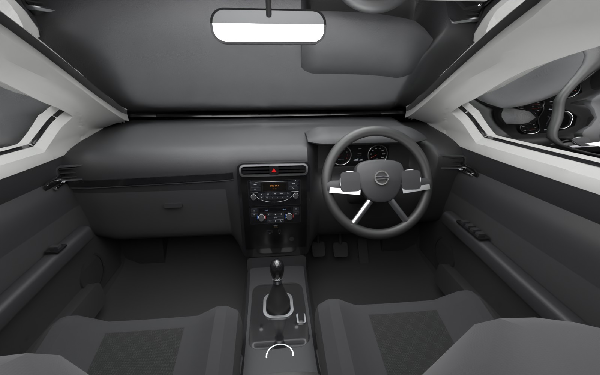 | 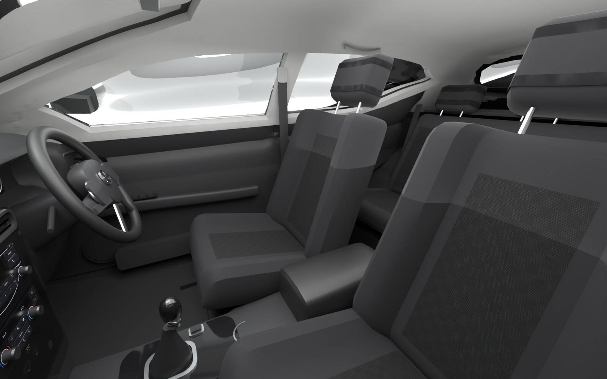 |
| 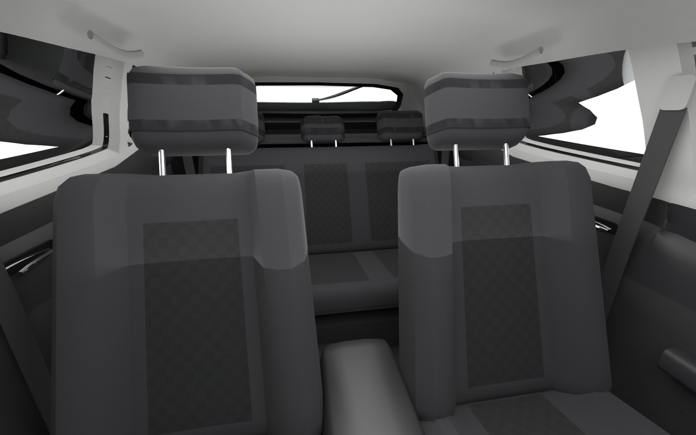 | 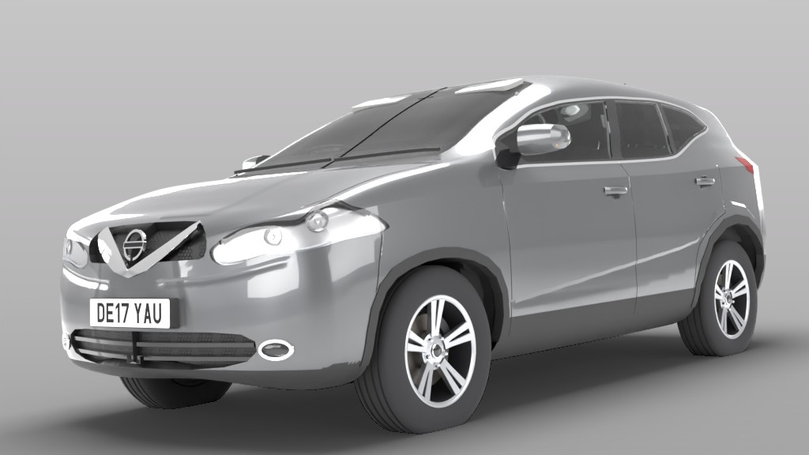 |

## What's modelled

- **Body shell**: one continuous surface measured from the photos, with the
  shoulder crease, and the lower-door swage that flows into the bulge over the
  rear wheel. The bonnet has its two converging creases, and the bumper steps
  back below a crisp crease under each headlamp. The door, bonnet, tailgate,
  bumper and fuel-flap shut lines are cut in as real grooves.
- **Glass**: windscreen with black frit and wipers, three side windows per side,
  and tailgate glass with frit and the rear wiper. The window openings have a
  chrome surround and gloss-black B and C pillars, and the mirrors sit on black
  sails.
- **Front**: pre-facelift chrome "V-motion" grille with honeycomb mesh and the
  Nissan roundel. Halogen headlamps: two chrome reflector bowls in a satin
  silver housing, a black shade along the top and the LED daytime strip along
  the lower edge. Lower grille with slats, oval fog lamps with chrome rings,
  and a black lower lip.
- **Rear**: boomerang tail lamps (red lens with the clear reversing band),
  roof spoiler with high-level brake light, rod aerial, recessed plate panel,
  Nissan roundel, chrome QASHQAI script on the tailgate, black lower bumper
  with reflectors.
- **Trim**: black wheel-arch mouldings and sill cladding, wheel-well liners,
  body-coloured mirror caps with indicator strips, body-coloured door handles,
  cowl panel.
- **Wheels**: 17 × 7J alloys on 215/60 R17 tyres, as on the owner's car: five
  pairs of broad flat spokes, each pair joined at the root and split by a slit
  that widens to about 2 cm at the rim. Tread grooves, lug nuts between the
  pairs, centre caps, brake discs and calipers. There's one wheel mesh, used
  four times.
- **Number plates**: DE17 YAU, white at the front and yellow at the rear. The
  characters follow UK plate proportions (79 mm tall, 50 mm wide, 14 mm stroke,
  11 mm and 33 mm spacing on a 520 × 111 mm plate).
- **Interior** (from the owner's photos; right-hand drive, 6-speed manual):
  - Soft-touch dashboard with the hooded instrument binnacle and dials (rev
    counter, mph speedo, centre display), four chrome-ringed vents, the
    hazard switch, and the gloss-black band across the passenger side.
  - Piano-black centre stack with the CD / radio unit and the dual-zone
    climate control (AUTO and DUAL knobs), airbag lamp and USB / AUX sockets.
    The lettered panels are textures.
  - Three-spoke leather steering wheel with satin inserts, the audio and
    cruise-control switch pads, and the Nissan badge; column stalks and pedals.
  - Console with the gloss-black gear knob, leather gaiter and satin surround,
    the electronic parking-brake switch, two cup holders and the armrest.
  - Cloth seats: charcoal bolsters with lighter patterned centre panels,
    separate headrests, and a rear bench with three headrests. Seat belts.
  - Door cards with armrests, chrome handles on gloss-black bezels,
    speakers, pockets and window switches (four on the driver's door).
  - Light-grey headliner and pillar trims, sun visors, interior mirror, map
    lights, grab handles, carpeted floor and boot with wheel-house covers and
    the parcel shelf.

Size: **4341 mm** bumper to bumper (4356 mm with the front plate), **1806 mm**
wide (2064 mm over the mirrors), **1590 mm** high, **2646 mm** wheelbase. For
why the length differs slightly from the published 4377 mm, see
[Accuracy](#accuracy).

## Folder layout

```
blender/
  build_qashqai.py      builds the car, materials, UVs, collision; exports everything
  qashqai_body.py       the measured body surface (profiles, sections, plan shape)
  qashqai_features.py   feature outlines: windows, gaps, arches, lamps, grille, ...
  body_mesh.py          maps outlines onto the surface and cuts them in (Delaunay overlay)
  body_build.py         classifies the shell faces, builds glass, lamps, mouldings
  qashqai_parts.py      wheels, liners, mirrors, handles, badges, plates, fog lamps
  qashqai_interior.py   the interior: trims from the shell, dash, wheel, console, seats
  mesh_kit.py           small procedural mesh toolkit
  plate_texture.py      UK number plate texture (numpy glyphs, no fonts needed)
  qashqai_textures.py   honeycomb grille, plastic grain and seat cloth textures
  make_interior_textures.py  draws the lettered interior panels (needs Pillow)
  assets/               those panels: centre stack, dials, wheel switch pads
  photo_cams.py         cameras solved from the reference photos
  render_views.py       Cycles studio renders (used with --render)
  verify_exports.py     re-imports the exports and checks size, pivots, UCX, slots
unreal/
  import_qashqai.py     UE5 editor script: textures, materials, meshes, Blueprint
export/                 ready-to-use output (generated by the build script)
  SM_Qashqai_Body.fbx       body, trim, lamps, badges, plates (+ UCX_ convex hulls)
  SM_Qashqai_Glass.fbx      window glass
  SM_Qashqai_Lenses.fbx     headlamp, tail-lamp and fog-lamp lenses
  SM_Qashqai_Interior.fbx   interior (dash, seats, trims, headliner, boot)
  SM_Qashqai_Wheel.fbx      one wheel, pivot at the hub centre
  Qashqai.fbx               the whole car in one FBX (for other DCC tools)
  Qashqai.glb               glTF binary with embedded textures (web, three.js, etc.)
  textures/                 plates, honeycomb, grain, seat cloth, interior panels
  manifest.json             parts, material slots, wheel positions (read by the UE script)
blend/Qashqai.blend     the Blender scene (textures referenced from export/textures)
renders/                Cycles previews, including views from the photo cameras
```

## Use it in Unreal Engine 5

The files in `export/` are ready to use, so you don't need Blender for this.

1. Copy this folder anywhere the editor can read. The UE project doesn't need it
   inside `Content/`.
2. Make sure **Python Editor Script Plugin** is enabled (Edit → Plugins; it's on
   by default in UE5).
3. Run `unreal/import_qashqai.py`: **Tools → Execute Python Script…**, or in the
   Output Log switch the input to *Python* and enter
   `py "C:/path/to/nissan-qashqai/unreal/import_qashqai.py"`.

The script creates, under `/Game/Vehicles/Qashqai2017`:

| Asset | Notes |
|---|---|
| `Textures/T_*` | Every texture listed in `manifest.json`: plates, honeycomb, plastic grain, seat cloth and the interior panels. The normal maps are set to *NormalMap* compression with the green channel flipped (OpenGL → DirectX). |
| `Materials/M_QQ_Paint` | Clear-coat master used for the Gun Metallic paint and the alloys. Exposes `BaseColor`, `Metallic`, `Roughness`, `ClearCoat` and `ClearCoatRoughness`. |
| `Materials/M_QQ_Solid` | Solid colour with emissive and an optional tiling detail normal (the grain on the black plastics, leather and dash; the cloth weave on the headliner and seat bolsters). |
| `Materials/M_QQ_Glass` | Translucent two-sided glass and lamp lenses. |
| `Materials/M_QQ_Plate` | One texture across the UVs: the number plates, the centre stack, the dials and the wheel switch pads. |
| `Materials/M_QQ_Grille` | Tiling colour and normal map: the grille honeycomb and the patterned seat cloth. |
| `Materials/MI_QQ_*` | One instance per Blender material slot. |
| `Meshes/SM_Qashqai_*` | Static meshes with generated lightmap UVs. The body carries three `UCX_` convex hulls. |
| `BP_Qashqai2017` | `Body`, `Glass`, `Lenses`, `Interior` and `Wheel_FL/FR/RL/RR` components. |

It also places one `BP_Qashqai2017` at the world origin. The origin is on the
ground midway between the axles, the nose points along +X, and the car sits on
its wheels.

- **Wheels**: each wheel component is pivoted at its hub. The right-hand wheels
  are the same mesh turned 180° in yaw. To roll them, rotate about the local Y
  axis (pitch). The script's `spin_wheels(actor, degrees)` helper does this in
  the editor. To steer the front wheels, change their yaw.
- **Paint colour**: edit `MI_QQ_Paint` → `BaseColor`. Gun Metallic is linear
  (0.125, 0.128, 0.133).
- **Interior**: `SM_Qashqai_Interior` is one mesh. Its trims face into the cabin,
  so it works with the single-sided materials. The body shell has no inside
  faces, so leave the interior component on for cameras inside the car.
- **Lights**: `MI_QQ_LED` (daytime running lights) and `MI_QQ_BrakeLight` have
  an `EmissiveColor` parameter. It's black by default, as in the photos.
- **Options**: set these environment variables before starting the editor, or
  edit the constants at the top of the script.
  - `QASHQAI_EXPORT_DIR`: folder with the FBX files and `manifest.json`
  - `QASHQAI_DEST`: content folder
  - `QASHQAI_SPAWN=0`: skip placing the car in the level

  Re-running the script updates the assets and rebuilds the Blueprint.
- **UE 5.5+**: FBX import goes through Interchange, which ignores the classic
  FBX options. The script switches `Interchange.FeatureFlags.Import.FBX` off
  while importing and restores it afterwards.

To import manually instead, use the defaults for a static mesh with *Import
Materials* off and *Auto Generate Collision* off, so the `UCX_` hulls are used.
Then assign the `MI_QQ_*` instances by slot name, and place the wheel mesh at the
positions listed under `wheels` in `export/manifest.json`.

## Rebuild or change the model in Blender

```bash
# With Blender installed (4.2 LTS or newer)
blender -b -P blender/build_qashqai.py -- --render

# Or with the Blender Python module (Python 3.11)
pip install bpy==4.5.14
python blender/build_qashqai.py --render --samples 96 --jpeg 90
python blender/verify_exports.py
```

Useful flags:

- `--out DIR`: export folder
- `--blend FILE`: where to save the scene
- `--render --views front_three_quarter,photo_left`: render a subset of views
- `--samples N`: Cycles samples
- `--ds 0.03`: coarser body mesh (default 0.02 m grid; about 200k body triangles)
- `--no-export`, `--no-interior`

Without `--render` a build takes a little over a minute. Each Cycles view
takes 1–4 minutes on 4 CPU cores (the interior views are the slow ones).

The lettered interior panels (radio, climate control, dials, wheel switches)
are pre-drawn PNGs in `blender/assets/`, so the build doesn't need Pillow. To
change one, edit `make_interior_textures.py` and run it with Pillow installed.

To change the shape, edit the profiles in `qashqai_body.py`, which are heights
and widths keyed along the car. To move or reshape a window, lamp, gap or trim,
edit its outline in `qashqai_features.py`, then rebuild. Outlines are given in
side (X, Z), front or rear (Y, Z) or top (X, Y) view coordinates in metres, or
as pixels in one of the reference photos. They are projected onto the surface
and cut in exactly, so every opening, lens and moulding lines up.

### How the body is built

- The shell is a loft. Each cross-section runs from the floor over the sill,
  the widest line, the shoulder crease and the beltline to the roof. Every
  control point follows a profile measured along the car. The plan shape of
  the nose is fuller at bumper height and more swept at headlamp height.
- Each feature outline is mapped onto the surface by ray casting. The grid
  cells it crosses are re-triangulated with a constrained Delaunay
  triangulation in the surface's parameter space, so outlines become exact
  mesh edges. Every face knows which regions it lies in, and that decides
  whether it becomes paint, chrome, black trim, glass or a lamp opening.
- Shut lines are V-grooves (5.5 mm wide, 4.5 mm deep). The swage, haunch and
  creases are analytic displacements, so the normals stay exact and the
  creases stay crisp.
- Glass, lenses, lamp housings, recessed grilles and arch mouldings are built
  from their regions of the shell, so each one fits its opening exactly.
- The interior trims (headliner, pillars, door cards, boot sides) are a copy of
  the shell offset inwards. They are thicker at the doors and thinner at the
  roof, and they return to every window edge, so the cabin is closed and
  follows the outside exactly. The colour changes (beltline, door-card
  split, boot trim) are cut into that mesh as edges, so they run straight.
- Triangle counts: body 201k, glass 21k, lenses 5k, interior 84k, wheel 12k
  (×4).

## Accuracy

- **Cameras**: all five photos of the 2017 car were solved.
  - The two side views came from the wheel centres and the roof silhouette.
    Their outlines match within about 1 cm.
  - The front and rear three-quarter views came from features measured in the
    side views (door handles, window corners, pillars) plus the silhouette.
    They're less certain, to about 2–3 cm.
  - The cameras are in `photo_cams.py`, and the `photo_*` renders use them, so
    renders can be laid over the photos.
- **Tracing**: side features were traced in the side photos and back-projected
  onto the surface. These are the windows, pillars, door gaps, handles, arches,
  cladding, fuel flap and the side of the headlamps and tail lamps. The grille,
  chrome V and headlamp fronts were traced in the front three-quarter photo.
  The rear features came from a photo-textured rear elevation.
- **Length**: the photos put the front bumper 3–7 cm behind where the published
  4377 mm length puts it. The rear matches. The model follows the photos:
  4341 mm bumper to bumper, 4356 mm with the plate. To match the published
  figure instead, stretch the front profile keys in `qashqai_body.py` (every
  key forward of X = 1.9 m, plus `X_F`).
- **Paint**: the grey was calibrated in a render set up to match the 2019
  reference photos (same studio levels) against the Gun Metallic car in those
  photos. The owner's car agrees: the front door in its side photo averages
  RGB 153/153/154, and the same place in `renders/side.jpg` is 154/155/159.
- **Owner's photos**: the dealer photos of the owner's car (when new) set the
  interior layout, the seat cloth, the dashboard and centre stack, the
  steering-wheel switches, the wheel design and the QASHQAI badge position.
  Interior sizes (seat positions, dash depth, console height) are scaled from
  the photos and the body. They are close but not measured.
- **Guesses**: some parts can't be seen in any photo. These are the underside,
  inside the lamps, the exact sections of the roof and bonnet, and the hidden
  parts of the interior (under the dash, the pedal box). They follow the
  visible construction and are plausible guesses rather than measurements.

## Testing status

- The Blender pipeline was run end to end with Blender 4.5.14 LTS (the PyPI `bpy`
  module). `verify_exports.py` passes. It checks the body length, centring and
  roof height, the wheel size and pivot, and the UCX naming and material slots
  in every FBX. It also checks that the interior sits inside the body with the
  headliner and door cards facing the cabin, that the texture files exist, and
  the GLB node layout, wheel positions and textures.
- The Unreal script uses the same API as the bunk bed import script in this
  repository (`AssetImportTask`, `MaterialEditingLibrary`,
  `SubobjectDataSubsystem`, `EditorActorSubsystem`), plus the clear-coat and
  translucency material settings. It was dry-run against a stand-in for the
  `unreal` module (every texture imported, every texture parameter and
  material slot assigned). It has **not** been run inside a live Unreal Editor
  in this environment. If a call differs in your engine version, the
  Output Log shows the line, and the FBX files can always be imported by hand as
  described above.
